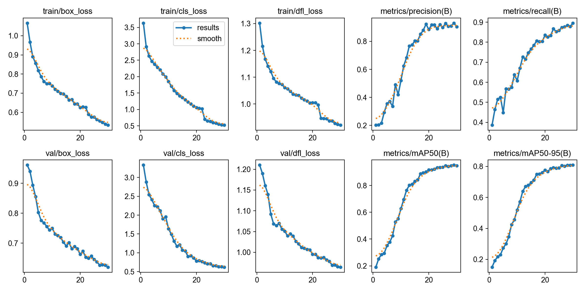
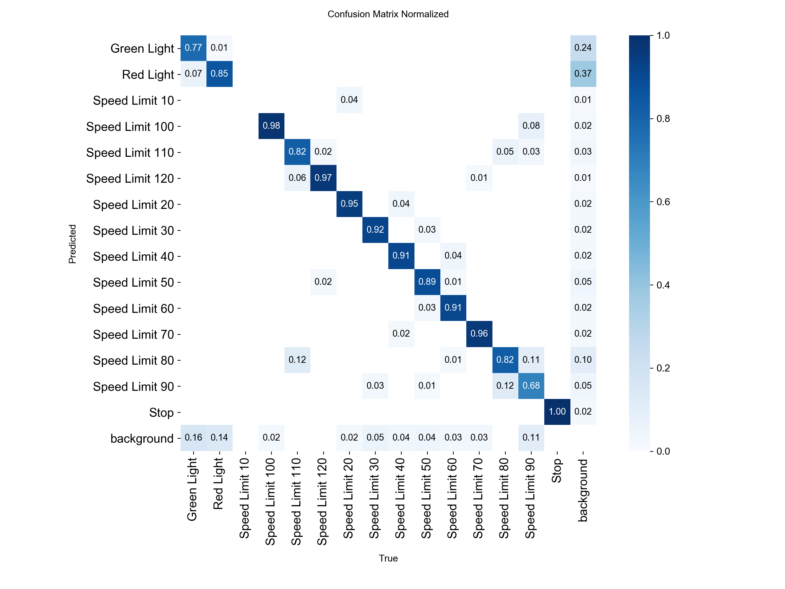
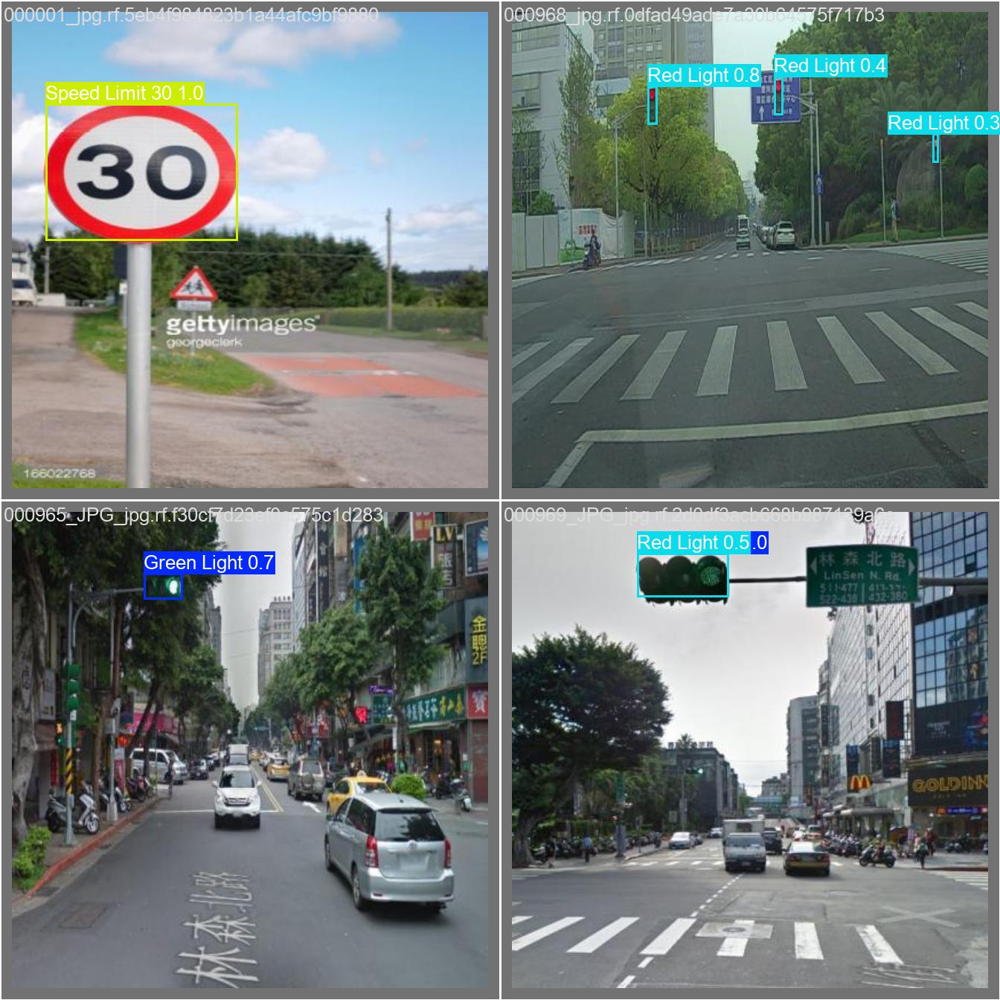
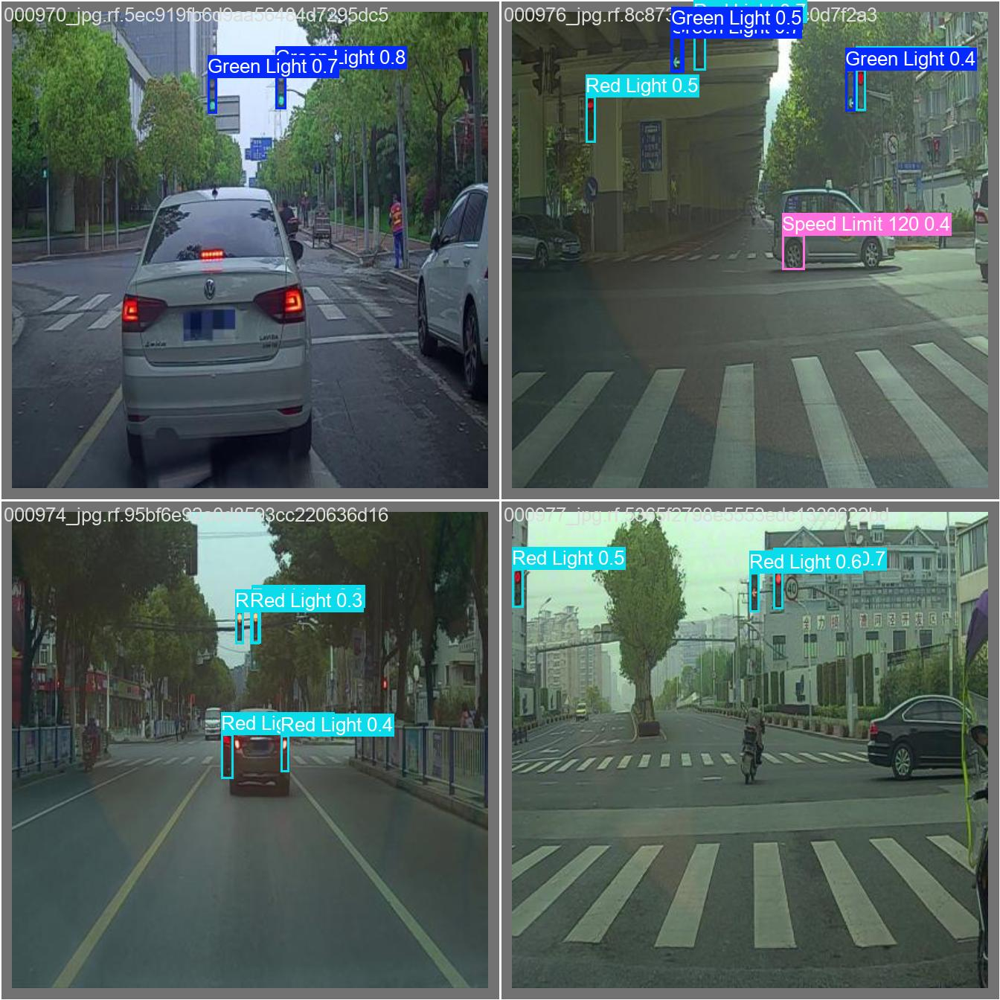

[第四次实验报告.md](https://github.com/user-attachments/files/27901524/default.md)
# 交通标志检测实验报告

姓名：揭思佳
学号：112310040207

## 1. 实验目标
本实验使用 YOLO 目标检测模型完成交通标志检测任务，识别数据集中 15 类交通目标，包括红绿灯、停车标志和多种限速标志。实验内容包括数据集分析、类别不平衡处理、模型训练、验证阶段参数调优，以及对损失曲线、评价指标、混淆矩阵和预测结果的综合分析。

---

## 2. 实验环境
- 操作系统：Windows 11（10.0.26200）
- Python 版本：3.12.5
- PyTorch 版本：项目依赖要求为 `torch>=2.3.0`（当前工作区未保留确切安装版本记录）
- YOLO 版本：Ultralytics YOLO，项目依赖要求为 `ultralytics>=8.3.0`
- 硬件环境（CPU / GPU）：CPU（训练记录中的 `device=cpu`，当前环境未检测到可用 CUDA）

---

## 3. 模型与训练设置
### 3.1 模型选择
本实验使用的模型为：
- 模型名称：YOLOv8n（预训练权重 `yolov8n.pt`）
- 选择该模型的原因：当前实验环境采用 CPU 训练，`YOLOv8n` 参数量较小、训练和推理速度更适合本机环境，同时在交通标志这类小目标检测任务上仍能提供较好的精度。为缓解类别不平衡问题，训练前额外构建了平衡训练集，将训练样本数从 3530 扩展到 6176，其中稀有类别 `Speed Limit 10` 的重复倍数达到 8 倍。

### 3.2 训练参数
- 训练轮数（epochs）：30
- 图像尺寸（imgsz）：640
- batch size：2
- 优化器：AdamW
- 学习率：初始学习率 `lr0=0.003`，最终学习率比例 `lrf=0.01`
- 是否使用数据增强：是。使用了 HSV 扰动、平移、缩放、水平翻转和 Mosaic 等增强，其中 `mosaic=0.5`、`scale=0.35`、`translate=0.1`、`fliplr=0.5`，并在最后 8 个 epoch 关闭 Mosaic。

### 3.3 训练命令
```bash
python build_balanced_dataset.py
python train_detector.py --device cpu --model yolov8n.pt --epochs 30 --imgsz 640 --batch 2 --optimizer AdamW --lr0 0.003 --name traffic_sign_strong
```

---

## 4. 训练过程分析

### 4.1 损失曲线
训练结果图 `results.png` 同时包含训练/验证损失与评价指标变化曲线。



请结合图像回答以下问题：
1. 损失总体呈持续下降趋势。`train/box_loss` 从约 1.07 下降到 0.53，`train/cls_loss` 从约 3.63 下降到 0.52，`train/dfl_loss` 从约 1.30 下降到 0.92；验证集对应损失也同步下降，说明训练是有效的。
2. 前 1 到 10 个 epoch 下降最快，尤其是 `cls_loss` 和 `mAP50` 变化最明显，说明模型在训练早期快速学到了主要类别特征。
3. 20 个 epoch 以后曲线明显趋于平稳，损失继续缓慢下降，说明模型已进入收敛阶段。
4. 曲线整体较平滑，没有出现明显的大幅震荡；验证损失没有在后期持续反弹，因此没有明显的严重过拟合现象，但后期精度提升已经趋缓，继续训练的边际收益有限。

### 4.2 评价指标变化
同一张结果图中也包含 `Precision`、`Recall`、`mAP50`、`mAP50-95` 的变化曲线。


请简要分析：
1. 提升最明显的是 `mAP50` 和 `mAP50-95`。其中最终 `mAP50(B)=0.94762`，`mAP50-95(B)=0.80836`；`Precision(B)` 和 `Recall(B)` 也分别提升到 `0.90470` 和 `0.89558`。
2. 最终模型在验证集上的检测效果较好，说明它已经能够较稳定地识别大部分类别，尤其是形态较清晰的限速标志和停车标志。
3. 从曲线形态看，模型在 20 到 25 个 epoch 后已基本收敛，最后几个 epoch 仍有小幅提升，但增幅已经明显减弱。

---

## 5. 混淆矩阵分析

下图为归一化混淆矩阵。



请重点分析：
1. 识别效果最好的类别包括 `Stop`（对角线约 1.00）、`Speed Limit 100`（约 0.98）、`Speed Limit 120`（约 0.97）、`Speed Limit 70`（约 0.96）和 `Speed Limit 20`（约 0.95），这些类别特征相对清晰，且边界形状较稳定。
2. 最容易混淆的类别主要是相近的限速标志和交通灯类别，例如 `Speed Limit 80` 与 `Speed Limit 90` 存在双向混淆，`Speed Limit 110` 与 `Speed Limit 120` 也有一定混淆；`Green Light` 与 `Red Light` 之间也会相互误判。
3. 造成类别混淆的主要原因有三点：一是不同限速牌在外观上高度相似，仅数字不同；二是交通灯目标通常较小、距离较远，受模糊、遮挡和光照影响明显；三是数据集本身存在类别不平衡，例如 `Speed Limit 10` 仅有 19 个标注框，而 `Red Light` 和 `Green Light` 都在 500 个以上。
4. 从混淆矩阵可以看出，模型对小目标和相似类别的细粒度判别能力仍然有限，尤其是部分交通灯与高相似度限速牌仍会出现误检、漏检或类别偏差。

---

## 6. 检测结果分析

下面给出两组验证集预测结果示例。




请分析：
1. 对于尺寸较大、外观清晰、背景简单的目标，模型检测较准确。例如单个近距离限速牌可以被高置信度正确识别，多数路口场景中的红绿灯也能被成功定位。
2. 在部分复杂街景图像中仍存在漏检和误检。例如远距离、尺寸很小的交通灯置信度偏低，个别目标会出现重复框；在复杂纹理区域还会出现将非目标区域误判为限速标志的情况。
3. 误检和漏检的原因主要包括：目标过小、遮挡严重、光照条件复杂、背景干扰较强，以及相似类别之间的视觉差异过于细微。尤其是红绿灯和高相似度限速牌，在远距离下更容易发生类别混淆。
4. 小目标、遮挡目标和远距离目标的检测效果明显弱于近距离清晰目标。模型虽然能够检测出一部分远处交通灯，但置信度通常较低，稳定性也不如大目标，这也是当前模型最需要继续改进的方向。

---

## 7. 提交成绩
- 本地验证结果：训练结束时 `mAP50(B)=0.94762`，调参后验证集 `mAP@0.5(all classes)=0.87493`
- 比赛网站提交分数：未提供（当前工作区仅包含 `submission.csv`，未见线上成绩记录）
- 当前排行榜名次（如有）：未提供

请简要说明：
1. 由于缺少比赛网站的实际提交记录，暂时无法直接判断本地验证结果与线上提交分数是否一致。
2. 即使后续线上分数与本地验证不完全一致，也属于正常现象，原因通常包括验证集与隐藏测试集分布差异、调参过程针对验证集产生的偏好，以及线上评分只基于未公开标签的测试集。

---

## 8. 实验总结
本次实验基于 YOLOv8n 完成了交通标志检测任务，并通过平衡训练集与验证阶段参数调优取得了较好的检测效果。模型的主要优点是训练过程稳定、收敛较好，对大多数清晰目标能够实现较高精度检测。当前最明显的问题是对小目标、远距离目标以及高相似度类别的区分能力仍然不足。若继续改进，下一步我会优先尝试更强的模型规模（如 `yolov8s`）、更高分辨率训练、类别加权或更有针对性的数据增强，并进一步进行多模型集成与测试时融合优化。
